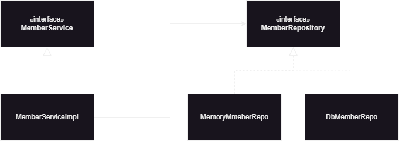
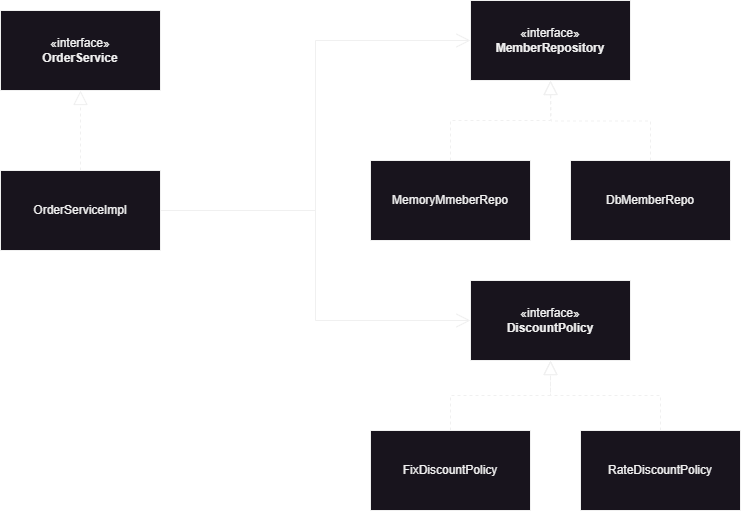

# [인프런-김영한]스프링 핵심 원리 기본편

# 2장 내용 

## 1. 회원 도메인 설계

- 회원 도메인 요구사항
  - 회원 가입 및 조회
  - 등급은 일반과 vip가 존재
  - 회원 데이터는 어디에 저장할지 아직 미확정 상태

> 회원 클래스 다이아그램
<p align="center">
  
</p>


```
//회원 서비스 구현 객체
public class MemberServiceImpl implements MemberService {
    private final MemberRepository memberRepository = new MemoryMemberRepository();
    @Override

    public void join(Member member) {
        memberRepository.save(member);
    }

    @Override
    public Member findMember(Long id) {
        return memberRepository.findMember(id);
    }
}
```
```
//회원 저장소 구현 객체
public class MemoryMemberRepository implements MemberRepository{
    HashMap<Long, Member> store = new HashMap<>();
    @Override
    public void save(Member member) {
    store.put(member.getId(), member);
    }

    @Override
    public Member findMember(Long id) {
        return store.get(id);
    }
}
```

## 2. 주문, 할인 도메인 설계

- 주문과 할인 정책
  - 회원은 상품 주문이 가능하다.
  - 회원 등급에 따라 할인 정책을 적용할 수 있다
  - 할인 정책은 VIP는 1000원 적용 
  - 할인 정책은 변경 가능성이 높음. 최악의 경우는 할인을 적용하지 않을 수도 있음


- 주문 도메인 협력, 역할 책임
  - 1.주문 생성
  - 2.회원 조회
  - 3.할인 적용
  - 4.주문 결과 반환

실제로 주문 데이터는 DB에 저장되어야 하지만 여기서는 단순히 주물 결과를 반환하는 식으로 진행

> 주문 클래스 다이아그램
<p align="center">
  
</p>

위의 설계는 역활과 구현을 분리해서 설계한 예시이다. 이렇게 할 경우 회원 저장소는 물론 할인 정책 또한 유연하게 변경이 가능하다. 

즉 OrderService 구현객체는 회원 저장소 구현 객체가 아닌 단순 회원 저장 객체와 할인 정책에 의존하게 되며 메모리 저장 방식이 아닌
DB 저장 방식으로 변경하더라도 주문 객체에서의 코드는 변경이 이루어 지지 않는다. 할인 정책에 대한 의존도 마찬가지로 변경이 일어나도 
주문 객체에서 코드 변경은 이루어지지 않는다.

